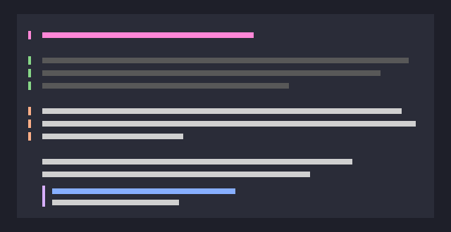
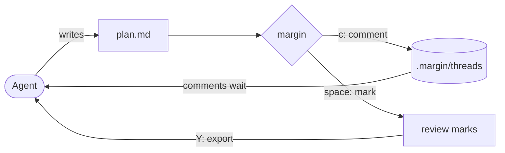
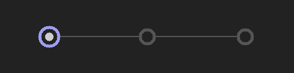
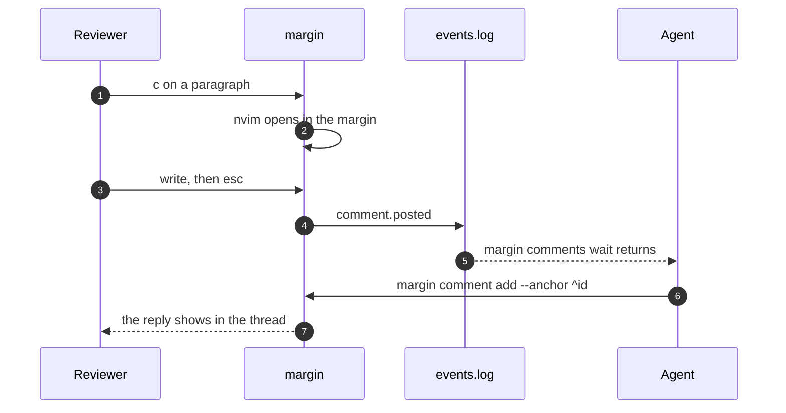
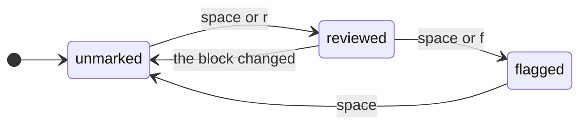

# A tour of margin

margin is a terminal tool for reviewing markdown. You read the **rendered**
document, leave comments anchored to *blocks*, mark what you have reviewed, and
hand the whole review back to whatever wrote the document. Press `j` and `k`
to move, `c` to comment, and `space` to mark a block. The [keys](#keys) are
listed below.



## The loop

An agent writes a plan, you review it in margin, and the agent reads your
comments back, either from the export or by waiting on the event log.





## What a comment does



## A block's review state



## Keys

| Key | Does |
| --- | --- |
| `j` / `k` | Move between blocks |
| `c` | Comment on the focused block |
| `space` | Cycle the mark: unmarked, reviewed, flagged |
| `/` | Search |
| `\` | Raw source |
| `i` | Every thread under review |
| `Y` | Copy the review |

## Try it

- Mark this list item reviewed with `r`.
- Flag this one with `f`.
  - Nested items are blocks too.
- [x] Open the demo
- [ ] Leave a comment on the diagram above

> A quote is a block like any other: comment on it, or mark it. Comments survive
> the block being reworded, because they anchor to an id, not a line.

The export is what the agent reads:

```go
// margin --stdout plan.md | agent -p "address this review"
type Review struct {
	Doc     string
	Threads []Thread
}
```
