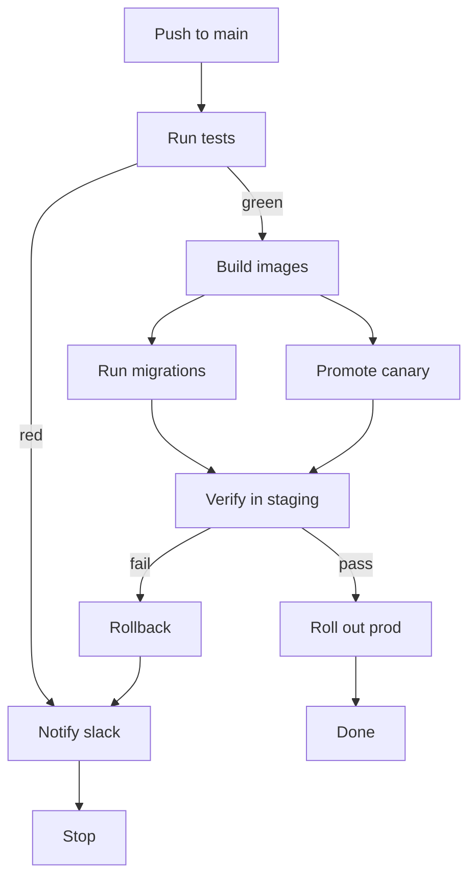
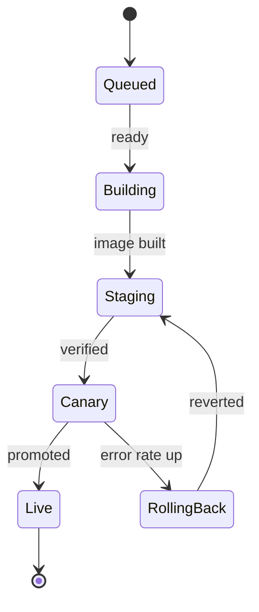
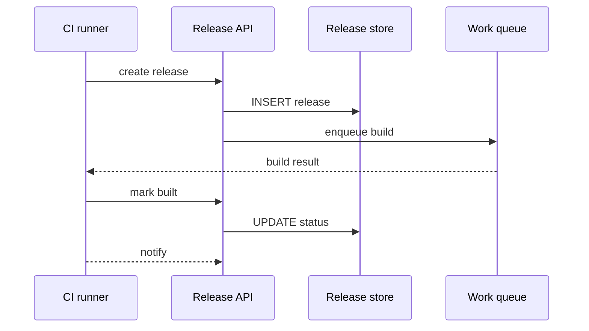
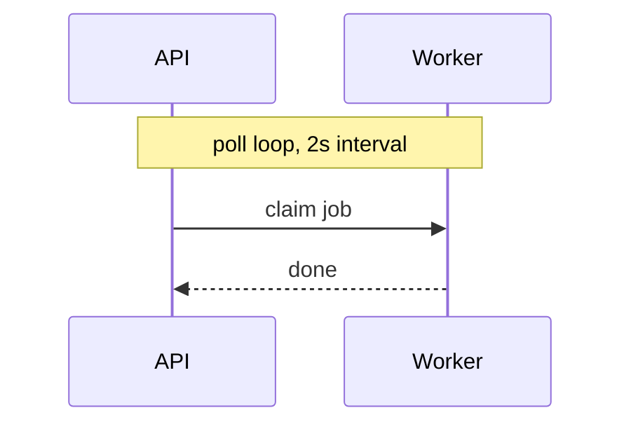
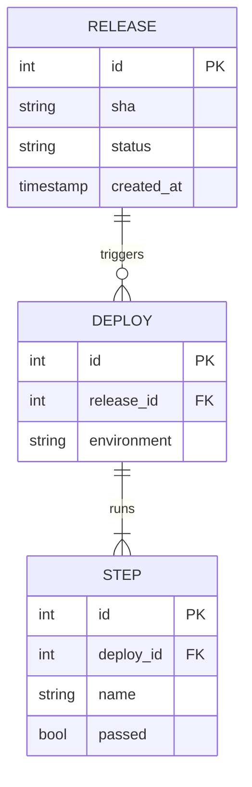
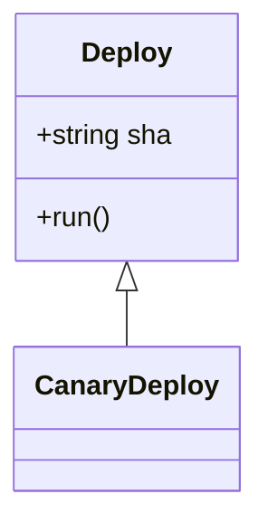

# Release train architecture

This document is a single map of the release-train pipeline: the deploy
workflow, the services it drives, the states a release passes through, and the
data model the release store is built on. The diagrams are mermaid, so they
render as ASCII in the review.

## Deploy workflow

The deploy pipeline starts when a push lands on `main`. Each stage gates the
next, and a failure anywhere stops the train rather than half-deploying:

The `flowchart TD` direction is honoured by the renderer, and the `|green|`
and `|red|` edge labels name the branch each arrow takes. A train that fails
lands on `Notify slack` and `Stop`, never on a half-deployed state.

## The release lifecycle

A release passes through the states below. The start and end markers are the
`[*]` pseudo-states; the transitions carry the signal that moves the release
onward:

## What talks to what

The pipeline talks to four services. The solid arrows are synchronous calls,
the dotted ones asynchronous queue messages:

`activate`/`deactivate` are tolerated but not drawn, so a diagram that uses
them still renders. Notes over a span of participants render on the lifeline:

## The data model

The release store is a relational schema. The cardinality markers follow the
crow's-foot notation mermaid uses:

Attributes in the entity bodies render as a labelled block; relationships draw
between the entities. A relationship's label ("triggers", "runs") sits on its
connector.

## Unsupported kinds

Kinds the renderer does not understand fall back to their plain source lines,
never chroma and never a half-parsed diagram:

---

## Review guide

Open the document and walk the blocks with `j`/`k`: each diagram is one focus
stop. `H`/`L` pan a diagram wider than the terminal; `\` switches to the raw
source to confirm the mermaid behind a given box.
