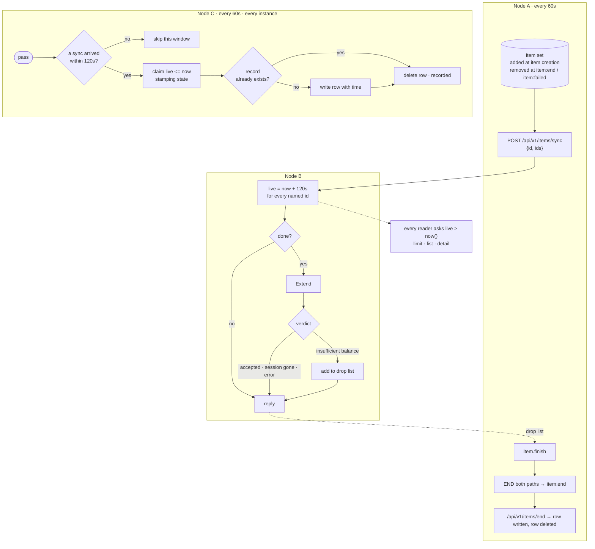

# Mermaid layout failure

Mermaid diagram layout failure on this example — a `flowchart TB` with three
subgraphs, mixed node shapes (database `[("…")]`, `{"…"}` decision, `["…"]`),
multi-line ` ` labels, and dotted edges with labels.

Roughly 40 nodes across three subgraphs; the rendering breaks apart / overlaps,
so it is unreadable.

Anonymized reproduction (real service names, endpoints and domain terms replaced
with neutral placeholders; structure, shapes, subgraph boundaries and label
lengths kept identical so the layout failure reproduces):

The domain terms above are placeholders — the real diagram used proprietary
service/endpoint names, deliberately not recorded here.
