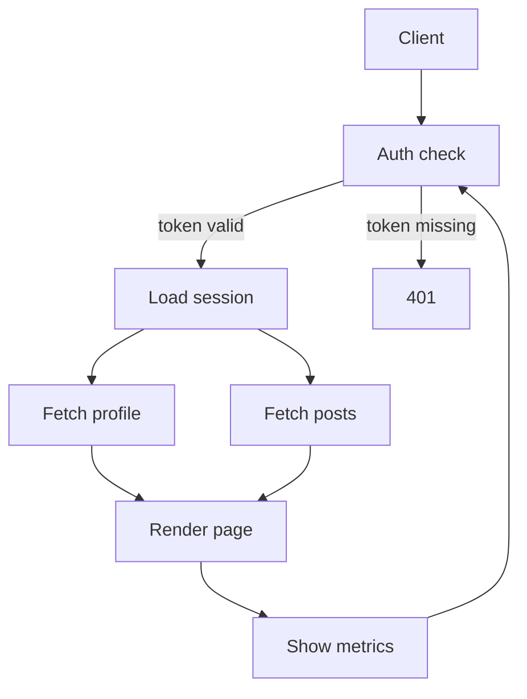

# 2026-08-10.17 — mermaid diagrams render as ASCII flowcharts

Kind: felt
Task: (feedback feature) support mermaid diagrams in the review — an ASCII
renderer for the common diagram kinds instead of chroma's meaningless colours
on mermaid source. Drains `vault/feedback/2026-08-10-mermaid-diagrams.md`;
the file is deleted.
Commit: (this one)

## What changed

A fenced block whose info string is `mermaid` now renders through a new
in-tree ASCII renderer (`internal/review/mermaid.go`) instead of chroma, which
has no mermaid lexer and coloured a diagram's source lines with noise.

- **`flowchart`/`graph` only** — the most common diagram kind in the documents
  margin reviews. Every other mermaid type (`sequenceDiagram`, `classDiagram`,
  …) and any flowchart the parser does not understand falls back to the
  block's **plain source lines** (not chroma, and never a half-parsed
  diagram). `parseMermaidFlowchart` requires the `flowchart`/`graph` header
  and rejects the whole block on a single unparseable statement — strictness
  is the "never render garbage" guarantee.
- **Boxed tree layout.** Nodes render as bordered boxes (rectangle, rounded
  `╭─╮` for `()` shapes, and a `◇` in the top border for a `{}` decision — the
  one shape that changes how a flow reads). Edges hang off a spine beneath
  each box with `├`/`└` junctions and `▼` arrowheads, `─` for a plain `---`
  link. A single child hangs straight below its parent centred on the spine,
  so a chain reads as one vertical flow instead of a staircase of indents.
- **Edge labels never truncate.** `-->|text|`, `-- text -->`, `==>`,
  `-.->` all parse; a label that fits the connector run sits centred on it
  (`├─token valid─▼`), and one that does not gets its own row above the
  arrowhead, right-aligned to it — so "token missing" is never reduced to
  "tok…".
- **Reconvergence and cycles terminate.** A node reached by a second path —
  a shared target like two branches meeting at "Render page", or a back-edge
  that closes a loop — draws a dim `↩ text` reference to its first occurrence
  instead of a second box; a node no root can reach is named on a dim
  `(unreachable: …)` line. The graph needs no layout engine because the
  layout is a tree.
- **Parsing scope.** Chained links (`A --> B --> C`), `&`-joined endpoints,
  `%%` comments, `subgraph`/`end` bodies (parsed without the subgraph frame),
  `direction`/`classDef`/`style`/`linkStyle`/`click` skipped. Bracketed node
  text is skipped when scanning for link tokens, so `A[1 --- 2]` is one node,
  not a link.
- **Raw mode** keeps a mermaid fence as plain source (no chroma), and H/L
  horizontal scroll still works on a diagram wider than the terminal (it is
  the `blockCode` path). Export and the thread files never know about mermaid
  — the on-disk format is untouched, per the feedback.

**What I chose and rejected:** the feedback's option 3 — an ASCII renderer
now, image protocol later — over the kitty-graphics-protocol route (option 2).
The image route depends on the terminal supporting the protocol, on external
tooling (mermaid-cli), and on the emulator's behaviour with out-of-band
escape data; the ASCII route always works, which is the property every other
renderer in margin shares. Within ASCII I chose a **tree** layout over a
general layered/orthogonal graph layout — the tree needs no crossing or
collision resolution and handles arbitrary branching, at the cost of
rendering a reconverging node as a `↩` reference rather than a merge
triangle, which is the obvious next step if the reference reads wrong. I
rejected `LR`/`RL` transposition (everything renders top-down), shape variety
beyond rectangle/round/decision (`[[ ]]`, `(( ))`, `{{ }}`, `[( )]`,
parallelograms all fall back to a rectangle box), dotted/thick link styling,
and `sequenceDiagram` — each is a named next leg, not a silent gap. The two
felt decisions left for the maintainer: whether the boxed tree is the right
shape at all, and whether the `↩`-for-reconvergence trick reads (see the
demo).

## Notes

The diagram is built as styled spans (`mspan`/`mrow`) with layout done on
plain rune counts and styling applied only at the end — column arithmetic
never touches SGR bytes. The trap that test caught: `strings.Index` returns a
byte offset, and box glyphs like `│` are three bytes, so a byte offset is not
a column; tests strip ANSI and count runes before comparing alignment.

## Verification

`make check` green (build, test, vet). `make test-race` green (render-path
only, no composer or emulator change, but run anyway).

Tests (`mermaid_test.go`):
- `TestParseMermaidFlowchart` — shapes, the two label spellings, `&` joins,
  chained links, plain `---`, bare nodes, `%%` comments.
- `TestParseMermaidFlowchartChains`, `TestParseMermaidFlowchartSkipsBracketedDashes`,
  `TestParseMermaidFlowchartIgnoresComments`.
- `TestRenderMermaidChain` — a chain is centred, no staircase.
- `TestRenderMermaidDecisionTree` — `◇`, labels, `├`/`└`, branch boxes aligned.
- `TestRenderMermaidSharedNode` — reconvergence renders one box + `↩`.
- `TestRenderMermaidCycleTerminates` — a cycle terminates and shows `↩`.
- `TestRenderMermaidLabelsNeverTruncate` — a long label gets its own row.
- `TestRenderMermaidRejectsNonFlowchart` — sequence/class/gantt are unsupported.
- `TestRenderMermaidFallsBackOnGarbage` — dangling links and unknown headers
  are unsupported.
- `TestMermaidBlockRendersInModel` — a mermaid fence in a document renders as
  a diagram, no source leaks.
- `TestMermaidUnsupportedBlockFallsBackToPlainSource`,
  `TestMermaidRawModeKeepsSourceVerbatim`.

Smoke-tested by hand: `make build`. How the tree actually reads on a terminal
is the felt part (below) — I have no screen and cannot claim it.

## For the maintainer to look at

Whether a boxed tree with `↩` references for shared/cyclic targets is a
diagram a reviewer can read at a glance, whether the `◇` decision marker and
rounded corners are enough shape language, and whether the two-row junction
for long branch labels reads as a label or as noise.

## Demo

```bash
make build
cat > /tmp/flow.md <<'EOF'
# Request flow


EOF
./bin/margin /tmp/flow.md
# the block should read as a boxed tree: Client at top, Auth check splitting
# into Load session (token valid) and 401 (token missing), Fetch profile and
# Fetch posts meeting at a single Render page, Show metrics looping back to
# Auth check as a dim ↩ reference. j/k walk the block as one focus stop, l
# does not dive (code blocks scroll horizontally instead), H/L pan a wide one.
```

Judge:
1. **The tree shape** — does a boxed tree read as a diagram, or is the
   indented-tree/`↩`-reference form wrong enough to want a real layered
   layout (spine + routed edges, merge triangles at reconvergence)? That is
   the biggest cost if wrong.
2. **Branch labels** — does `├─token valid─▼` on the run, with a long label
   dropping to its own row above the arrowhead (`   token missing▼`), read
   naturally? Should the overflow label instead sit on the run and let the
   run grow?
3. **Shape language** — is the `◇` in a decision's top border and the rounded
   `()` box enough to tell shapes apart, or do circles/cylinders/subroutines
   need their own glyphs now?
4. **Unsupported mermaid** — a `sequenceDiagram` (or any unparseable
   flowchart) falls back to plain source lines, no chroma. Right, or should
   the fallback also name what was skipped?
5. **Direction** — `flowchart LR` renders top-down. Is that a tolerable
   loss, or is a horizontal layout the next leg?
6. **Colour** — boxes/arrows are the muted `rawStyle` blue-grey with bright
   text; does the diagram sit comfortably against the prose?

(What I chose: an in-tree ASCII renderer for `flowchart`/`graph`, boxed tree
layout, `◇` for decisions, labels that never truncate, `↩` for
reconvergence/cycles, plain-source fallback, top-down only. What I rejected:
kitty-graphics image rendering, a general layered graph layout, `LR`
transposition, shape glyphs beyond decision/round, dotted/thick links,
`sequenceDiagram`.)
