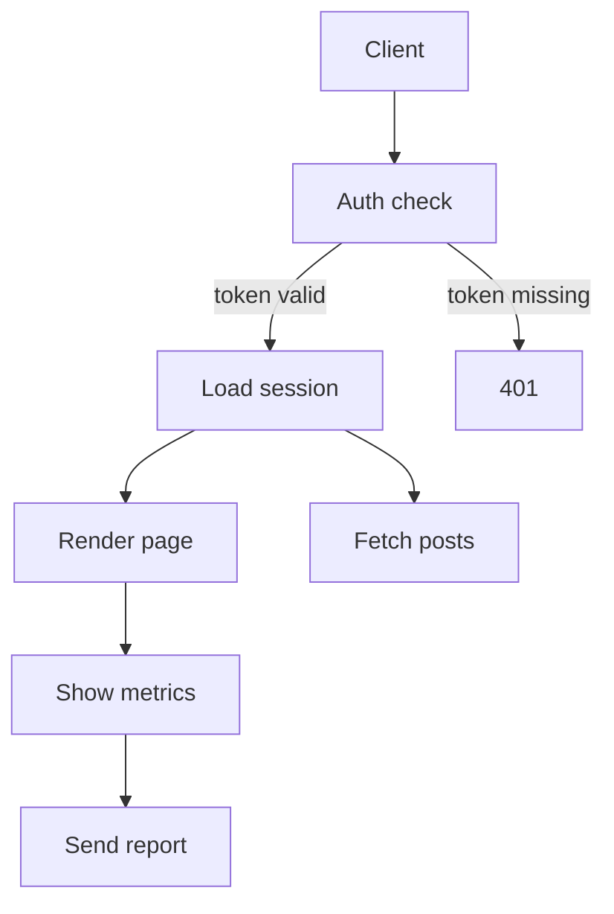
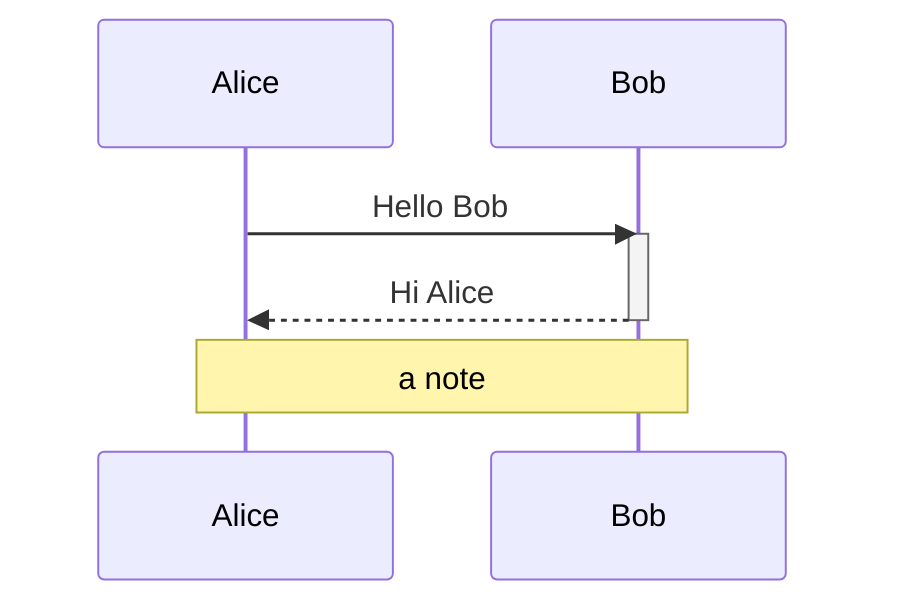
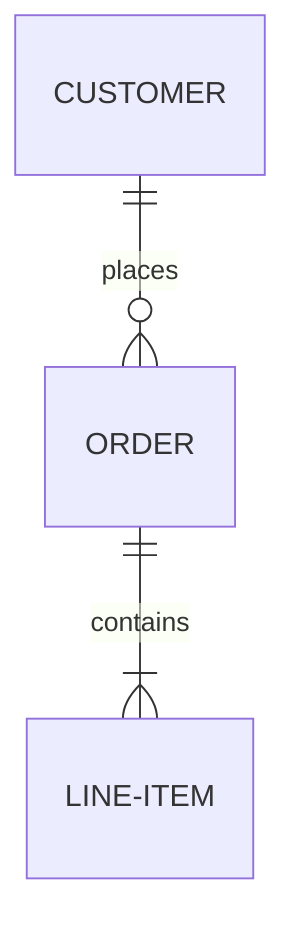
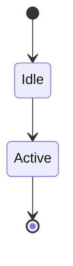

# 2026-08-10.19 — mermaid renderer vendored: sequence, ER and graph from upstream

Kind: felt
Task: (feedback feature) support mermaid `sequenceDiagram` and `stateDiagram-v2`
— slice 1 of `vault/feedback/2026-08-10-mermaid-sequence-and-state.md`: vendor
`github.com/AlexanderGrooff/mermaid-ascii` for flowchart/graph, sequence and
ER, retire the hand-rolled flowchart renderer, and wire the vendored packages
behind the existing `renderMermaid` fallback contract. State diagrams remain
(a documented next leg). The feedback file stays open, updated to the remaining
scope.
Commit: (this one)

## What changed

- **Vendored the library** at `third_party/mermaid-ascii/` — a snapshot of
  upstream `v0.0.0-20260807155423-b1b35f67d6a5` with its MIT `LICENSE`, wired
  into the build by a `replace` in `go.mod`, so imports keep the upstream
  import paths (`github.com/AlexanderGrooff/mermaid-ascii/pkg/...`). Dropping
  the `replace` later restores a plain module dependency. A real Go
  `vendor/` directory was rejected: it would have snapshotted the whole module
  graph for one library.
- **Every local change is a numbered delta in the vendored `CHANGELOG.md`**:
  D1 trimmed the go.mod to the library packages; D2 extracted the graph
  renderer from upstream's cobra `cmd` package into `pkg/graph` (with an
  exported `Parse`/`Render` mirroring the other kinds); D3 made the graph
  parse strict so an unparseable statement fails the whole diagram; D4 brought
  the graph grammar to parity with the renderer it replaces (node shapes,
  `---`/`==>`/`-.->`/between-labels, skipped `direction`/`linkStyle`/`style`/
  `click`); D5 stripped gookit/color ANSI from the graph output; D6 tolerates
  `activate`/`deactivate` in sequences (bars not drawn yet). Upstream tests
  run in place: `cd third_party/mermaid-ascii && go test ./...`.
- **The hand-rolled `internal/review/mermaid.go` was deleted.** The file is now
  a thin dispatcher: strip frontmatter, route by the first meaningful line's
  keyword, render through the vendored `graph`/`sequence`/`er` packages, style
  the plain output with margin's diagram styles (box-drawing runs in the muted
  frame colour, text in the bright colour), and on any error or panic fall
  back to the block's plain source — the never-a-half-parsed-diagram contract,
  unchanged. On-disk format untouched.
- **Retirement decision, stated:** deleted, not kept as a fallback. The
  vendored graph renderer is a real layered layout, D4 keeps its grammar at
  parity with the old parser, and plain-source fallback covers every failure.
  Two flowchart renderers would mean two parsers and two shapes for one
  diagram.

**What I chose and rejected:** `third_party/` + `replace` over a full `go mod
vendor` (above); extracting the graph renderer into `pkg/graph` as a documented
delta over importing the upstream `cmd` package (which drags cobra and gin in);
deleting the hand-rolled renderer over keeping it as a fallback; routing on the
block's first meaningful keyword and letting each vendored package validate its
own header over trying every parser; run-based line styling (frame vs text)
over leaving the vendored output unstyled, and over trying to distinguish node
text from edge labels in the flat output (the output cannot tell them apart —
one styling loss, flagged below).

## Notes

- The upstream graph parser is **lenient**: an unparseable statement becomes a
  node named after the whole line, so `A --- B` drew as one box. That is the
  exact "half-parsed diagram" margin forbids, and it is invisible to the
  upstream CLI's smoke tests. Recorded as F24; fixed here by deltas D3/D4.
- A replaced local module's `require` line carries the zero pseudo-version
  (`v0.0.0-00010101000000-000000000000`); the pinned upstream version lives in
  the vendored `README.md`, where a future re-vendor will find it.
- Files copied from the Go module cache are read-only; `chmod -R u+w` before
  editing the vendored copy.

## Verification

`make check` green (build, test, vet). `make test-race` green (render-path
change, no composer or emulator, run anyway). Vendored module's own tests
green (`go test ./...` in `third_party/mermaid-ascii`).

Tests (`mermaid_test.go`, rewritten for the vendored dispatcher):
- `TestRenderMermaidFlowchart` — shapes and all the common link forms render
  with labels, no source leak.
- `TestRenderMermaidFlowchartShapes` — every bracket family parses into the
  right id + label (`A((Start))` is "Start", not "A((Start))").
- `TestRenderMermaidFlowchartLinkForms` — `---`, `==>`, `-.->`, `-- x -->`
  and `== x ==>` all render.
- `TestRenderMermaidSequence`, `TestRenderMermaidSequenceActivations`,
  `TestRenderMermaidER` — the new kinds render through the dispatcher;
  `activate`/`deactivate` are tolerated.
- `TestRenderMermaidRejectsUnknownKinds` — state/class/gantt fall back.
- `TestRenderMermaidFallsBackOnGarbage` — dangling links, garbage lines,
  malformed sequences all fail the block.
- `TestMermaidDiagramStyled`, `TestMermaidBlockRendersInModel`,
  `TestMermaidSequenceBlockRendersInModel`,
  `TestMermaidUnsupportedBlockFallsBackToPlainSource`,
  `TestMermaidRawModeKeepsSourceVerbatim` — model-level behaviour, unchanged
  contract.

Smoke-tested by hand through the vendored packages (`make build`). How the
vendored layouts actually read on a terminal is the felt part (below) — I have
no screen and cannot claim it.

## For the maintainer to look at

Whether the vendored layouts are a net improvement over the boxed tree: the
upstream graph renderer does a real layered layout with routed edges (and
honours `LR`), but draws every node shape as a rectangle, splits a long
between-label across the vertical spine (`over│here`), and draws arrowheads on
plain `---` links too. Sequence and ER are entirely new capabilities.

## Demo

```bash
make build
cat > /tmp/diagrams.md <<'EOF'
# Review me








EOF
./bin/margin /tmp/diagrams.md
# three of the four fences should render as diagrams; the stateDiagram-v2
# should show its source lines (state rendering is the next leg).
```

Judge:
1. **The graph layout** — does the layered layout (routed edges, real `TD` and
   `LR` columns) read better than the boxed tree it replaced? I chose upstream
   per the feedback and deleted the tree; if the tree was better, say so and
   the vendored copy stays but the dispatcher switches back.
2. **Shape language** — every node draws as a rectangle now (D4 parses the
   shapes but upstream has no glyphs). The old `◇` decision marker is gone.
   Needed, or does the layout carry the flow?
3. **Edge labels on a vertical run** — a long between-label can split across
   the spine (`over│here`, upstream's centring). Acceptable, or a delta to
   pin labels to a horizontal row?
4. **Plain `---` links** draw an arrowhead. Reads wrong, or fine?
5. **Sequence activations** — `activate`/`deactivate` are tolerated but no
   bars draw (delta D6). Bars worth a delta, or is the skip the right
   placeholder?
6. **Styling** — the flat output is styled run-wise (frame muted, text bright);
   edge labels now read as bright text instead of dim (the old renderer
   dimmed them). Does it sit against the prose?
7. **`flowchart LR`** now lays out horizontally (upstream honours the
   direction; the old renderer forced top-down). Does the wider shape feel
   right, or should LR stay top-down?

(What I chose: vendor at `third_party/mermaid-ascii` + `replace`, delete the
hand-rolled flowchart renderer, route by keyword, fall back to plain source on
any error or panic, style the flat output run-wise. What I rejected: a full
`go mod vendor`, importing upstream's `cmd` package, keeping the old renderer
as a fallback, and trying every parser instead of routing.)
