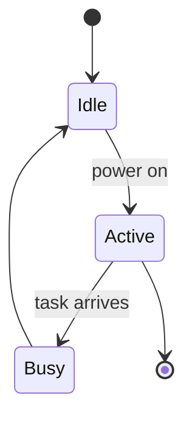
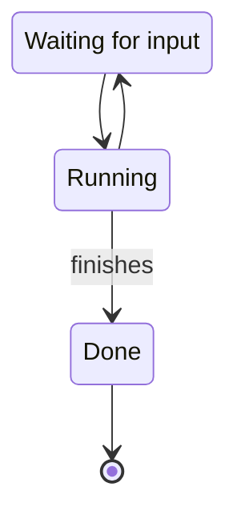
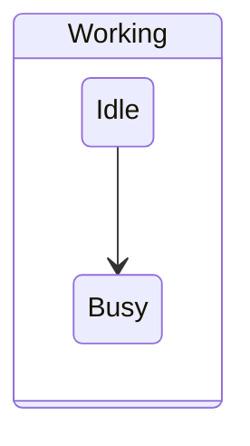

# 2026-08-10.20 — mermaid state diagrams: `pkg/state` in the vendored copy

Kind: felt
Task: (feedback feature) support mermaid `sequenceDiagram` and `stateDiagram-v2`
— the remaining half of `vault/feedback/2026-08-10-mermaid-sequence-and-state.md`:
add state diagrams inside the vendored `third_party/mermaid-ascii` as `pkg/state`
(states, transitions, `[*]` start/end, same fallback contract), following the
deltas' package shape. Drains the feedback file; the board item moves to Done.
Commit: (this one)

## What changed

- **New `pkg/state` in the vendored copy** (`third_party/mermaid-ascii/pkg/
  state/`, recorded as delta **D7** in its `CHANGELOG.md`, following D2's
  package shape: `Keyword`, `IsStateDiagram`, `Parse`, `Render` against a
  *diagram.Config*). `stateDiagram` and `stateDiagram-v2` both route there.
  The parser accepts declarations (`state Idle`, `state "Idle"`,
  `state "Idle all day" as Idle` — and a transition may then reference the
  state by id *or* description), `From --> To` and `From --> To: label`
  transitions, auto-creates undeclared endpoints, and skips `direction` lines
  and `%%` comments.
- **Layout: one centred spine.** Every state box is centred on a single
  arrow column; each transition draws a `│ label` run and a `▼` head between
  its source and target boxes; `[*]` start/end draw as `○`. Consecutive
  transitions that share a state keep the box (a chain `A → B → C` reads as
  one flow), while a branching source draws its box again for each branch —
  the simple tradeoff for not routing edges. States with no transitions stack
  as boxes.
- **Strict, same fallback contract.** Anything outside the subset — composite
  states (`state X { … }`), notes — fails the whole diagram, and the
  dispatcher in `internal/review/mermaid.go` (one new branch,
  `state.IsStateDiagram(rest)`) falls back to the block's plain source: never
  a half-parsed diagram. `internal/review/mermaid_test.go`'s "rejects
  unknown kinds" no longer lists state (now class/gantt), and the model-level
  fallback test moved from `stateDiagram-v2` to `classDiagram`.

**What I chose and rejected:** the single-spine layout over routing edges
(upstream's graph router is edge-driven and its boxes all draw as rectangles;
a state diagram is a flow of named boxes, and re-drawing a branch source reads
honestly), `○` over the graph renderer's `▼`-only vocabulary for start/end
(and over the sequence package's `'o'` — the ambiguous-width concern is
already moot, every box glyph margin uses is ambiguous), description-alias
registration over making the parser only key by id, and strict rejection of
composite states and notes over silently dropping them (a dropped `note` is a
lie, and drawing `state X { … }` boxes is a real layout problem worth its own
leg — see the gaps list in D7).

## Notes

- The vendored go.mod needed nothing new: `pkg/state` builds against
  `pkg/diagram` and `go-runewidth`, both already required.
- The board item was already claimed by the do-leg agent in the slice-1 leg;
  this leg completes and closes it.

## Verification

`make check` green (build, test, vet). `make test-race` green (render-path
change, run anyway). Vendored module's own tests green (`go test ./...` in
`third_party/mermaid-ascii`), including the new `pkg/state` parser and
renderer suites.

Tests:
- `pkg/state/parser_test.go` — both header spellings route; first-seen state
  order; declarations with descriptions and aliases; description-alias
  resolution; auto-create; composite states and garbage reject; direction and
  comments skipped.
- `pkg/state/renderer_test.go` — a chain draws each state once with no source
  leak; labels; descriptions; a branch re-draws its source per branch; no
  transitions stacks boxes; the ASCII glyph set.
- `internal/review/mermaid_test.go` — `TestRenderMermaidState`,
  `TestRenderMermaidStateLegacyKeyword`, `TestRenderMermaidStateRejectsComposite`;
  the rejects/fallback tests now use class/gantt.

Smoke-tested the flat output by hand through the vendored packages (`go run`
against a scratch module): chains, branches, descriptions, direction and
stacked boxes all render as expected. How the spine layout actually reads on a
terminal is the felt part (below) — I have no screen and cannot claim it.

## For the maintainer to look at

Whether the single-spine state layout is a good read: every box centred on one
arrow column, `[*]` as `○`, a branch's source box repeated once per branch,
and transition labels beside the spine. Also whether the strict fallback for
composite states and notes (a diagram using them shows its plain source) is
the right stop-gap, or whether composite states should be the next state leg.

## Demo

```bash
make build
cat > /tmp/states.md <<'EOF'
# Review me






EOF
./bin/margin /tmp/states.md
# fence 1 and 2 should render as state diagrams; fence 3 (a composite state)
# should show its source lines — that fallback is the strict-subset contract.
```

Judge:
1. **The spine layout** — every box centred on one arrow column with `│`/`▼`
   between them: does a multi-state flow read at a glance? I chose this over
   the graph renderer's edge routing (state diagrams are box flows, not routed
   graphs), over the old boxed-tree, and over trying to fit a real layout into
   this leg.
2. **`[*]` start/end markers** draw as `○`. Reads as start/end, or does it
   need a label?
3. **Branching repeats the source box** — `Wait` in fence 2 draws twice (once
   per outgoing transition). Acceptable for ASCII, or worth routing edges?
4. **Transition labels** sit beside the spine (`│ power on`). Clear, or should
   they read on their own row?
5. **Composite states and notes fall back to plain source** (fence 3). The
   strict-subset contract — right place to stop, or should a composite state
   be the next state leg?

(What I chose: a new `pkg/state` in the vendored copy as delta D7, one
centred spine with per-branch box repetition, `○` markers, strict fallback for
composite states/notes. What I rejected: routing edges, drawing composite
states, silently dropping notes, and keeping state out of the vendored library.)
