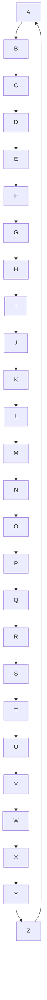

# 2026-08-10.22 — j/k walk through a block taller than the viewport

Kind: felt
Task: (feedback fix) `j`/`k` on a very tall block — a long mermaid diagram, a
big code block, a huge table — should scroll the viewport through the block a
few lines at a time instead of leaping focus to the next block, moving focus on
only at the block's far edge. Drains
`vault/feedback/2026-08-10-tall-block-jk-incremental-scroll.md`; the file is
deleted.
Commit: (this one)

## What changed

`moveFocus`'s block-level walk (internal/review/review.go) treats a block
taller than the viewport specially now. The plain walk was the problem: a tall
block is one focus stop, so `j`/`k` hopped straight to the neighbour and the
viewport leapt by the whole block height — one `j` and you were a screen away,
with no way to page through the block's content a few lines at a time.

Now, while focus sits on a block whose span is taller than the viewport
(`m.spans[i].end-start+1 > viewport`):

- `j`/`k` scroll the viewport through the block `tallWalkStep` lines at a time
  (3, matching the J/K incremental scroll and the default wheel tick) and never
  move focus.
- Only once the viewport reaches the block's far edge — its last row at the
  viewport bottom, or its first row at the top — does the next press move focus
  to the neighbour.
- **Landing on a tall block opens at the edge the walk is entering from**: its
  top when walking down, its bottom when walking up. The plain walk's
  `clampScroll` would otherwise drop into the block's middle (or, worse, pin
  its tail against the viewport bottom, hiding where it begins). The landing
  sets `scroll` and `scrollAnchor` directly, so `clampScroll` keeps the walked
  offset instead of re-deriving it.
- Mid-block scrolls keep `m.scrollAnchor` on the block, so the offset survives
  the next render's clamp.

**What I chose and rejected:** the 3-line step to match J/K (a larger step —
a quarter viewport, say — was tempting for very tall diagrams but would fight
the fine-grained walk J/K already gives); the entering-edge landing over always
aligning to the block's top (walking up should re-open where you left off, not
restart the block); keeping the leap in visual mode (a blockwise selection
wants the block as one stop, and mid-block scrolling would make j/k dead
presses mid-selection); applying it to every tall span, thread rows included,
rather than only code/tables/mermaid (a long thread reads the same way, and
there is no rule that carves threads out).

## Notes

- The dive into a table's/raw block's lines (`l`, then j/k per source line) is
  untouched and still the fine-grained path for those kinds; the tall-block
  walk is the coarse reading path that no longer overshoots.
- The step and the "taller than viewport" test both read `m.h` — before the
  first size message there is no viewport, but `moveFocus` cannot run before a
  frame renders either, so the guard is belt-and-braces.

## Verification

`make check` green (build, test, vet). `go test -race ./internal/review/`
green. New tests in internal/review/tall_test.go pin the walk from both
directions: landing at the entering edge, the 3-line scroll within the block,
moves-on exactly at the far edge, edge clamping at the first/last entry, the
visual-mode leap preserved, and a render-path test through a real tall code
block confirming the walked offset survives `clampScroll`.

## For the maintainer to look at

Whether the 3-line step and the "move on only at the far edge" feel right, and
whether landing at the entering edge (top when walking down, bottom when
walking up) is the right way to re-enter a block you have scrolled through
partway.

## Demo

```bash
make build
cat > /tmp/tall.md <<'EOF'
# Tall block walk

One short paragraph above the diagram, so there is a block to walk from.



Short paragraph below the diagram, so there is a block to walk onto.
EOF
./bin/margin /tmp/tall.md
```

Use a small terminal window (fewer rows than the diagram is tall) or `--wheel-speed` is irrelevant here.

1. **Walk down into the diagram:** `j` from the top paragraph lands the
   viewport at the diagram's **top**, not its middle or its tail. Then keep
   pressing `j` — each press scrolls down **3 lines** and focus stays on the
   diagram. Only when the diagram's last row reaches the bottom of the screen
   does the next `j` move focus to the bottom paragraph. I chose the 3-line
   step to match J/K and the entering-edge landing so a walk reads the block in
   order. Rejected: a larger step, and always jumping to the block's top.
2. **Walk up through it:** `k` from the bottom paragraph lands at the diagram's
   **bottom** (where you left it), and `k` scrolls up 3 lines at a time until
   the top, then moves focus on. Does re-entering at the edge you came in from
   feel right, or should `k` always restart at the block's bottom?
3. **The leap is gone:** with focus on the diagram, `j`/`k` no longer skip to
   the next block in one press. Is 3 lines per press the right reading speed, or
   does a very tall diagram want a bigger jump per press? (J/K still does the
   same 3-line no-focus scroll, and ctrl+d/u page.)
4. **Visual mode unchanged:** `V` then `j`/`k` still leap block to block — a
   selection spans the whole diagram in one press. Sensible, or should
   mid-block scrolling apply there too?
