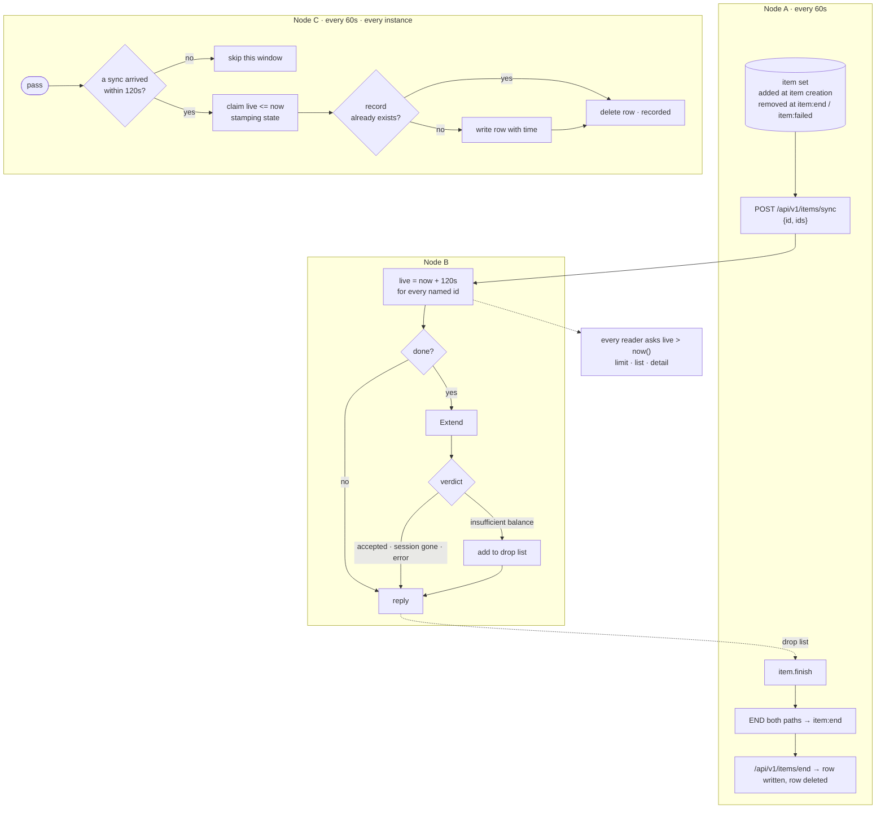

# 2026-08-12.5 — subgraph diagrams get their own layout band

Kind: felt
Task: Feedback `2026-08-12-mermaid-layout` — a `flowchart TB` with ~40 nodes
across three subgraphs renders broken / overlapping / unreadable.
Commit: (this one)

## What changed

The vendored graph engine's layered placement is subgraph-agnostic: a node's
grid coordinate comes from its graph level alone (roots at level 0, children
four cells further along the flow axis) against one shared slot counter per
level, and a subgraph's frame is then just a bounding box drawn around
whatever cells its nodes happened to land in. With several subgraphs the nodes
interleave across the same rows and columns, so two frames crash into each
other, a node draws on its own frame's border, and an edge label splits across
a frame line. The maintainer's anonymized reproduction did all three: Node A's
frame ran straight through Node B's nodes, and `drop list` split as
`drop│list` across a border.

**Delta D10** in the vendored `pkg/graph` fixes the placement:

- `createMapping` now dispatches: subgraphs present → `placeNodesByBand`,
  otherwise → upstream's `placeNodesByLevel`, untouched. The shared tail
  (column widths, edge paths, drawing coordinates, subgraph bounding boxes,
  offset) lives in `finishMapping`.
- `placeNodesByBand` levels nodes exactly as the flat path does (same
  root-then-children walk), but each **unit** — everything beneath one
  root-level subgraph, nested subgraphs included, or all nodes outside any
  subgraph as one trailing unit — keeps its **own per-level slot counter**, so
  a subgraph's nodes cluster in a contiguous band of grid cells instead of
  scattering across the whole row.
- Bands are sized to each unit's widest level and laid out end to end with a
  gap cell of `paddingX` (TD) / `paddingY` (LR) between them, so two frames
  can never touch. Node footprints are reserved in the grid — the flat path's
  `reserveSpotInGrid` job — so the A* edge router still routes around boxes,
  and the LR direction mirrors the bands along the other axis.

The flat path renders byte-identically (the existing flowchart tests pin it);
sequence, ER and state never take subgraphs, so they are untouched.

## What I chose and rejected

- **Banded placement** over upstream's post-hoc `ensureSubgraphSpacing`, which
  redraws boxes to avoid overlap but never moves the nodes — a "fixed" box
  still cuts through its own nodes.
- **Banding** over falling back to plain source: the layout is repairable and
  the reproduction is a legitimately renderable diagram.
- **Side-by-side bands (TD)** over stacking the subgraphs vertically: the flat
  layout already intended columns (roots spread along x), so bands preserve
  the existing mental model. The cost is width — the reproduction is ~180
  columns and needs H/L scroll. Flagged in the demo.

## Verification

`make check` green (build, test, vet). Not a composer or emulator change, so
`make test-race` not required. Vendored package tests green
(`go test ./internal/mermaid-ascii/...`).

New tests:

- `internal/mermaid-ascii/pkg/graph/subgraph_test.go`:
  - `TestSubgraphBoxesAreDisjoint` — the reproduction's three root frames are
    pairwise disjoint in drawing space.
  - `TestSubgraphBoxesContainTheirNodes` — every node draws inside its own
    subgraph's frame. (Verified: with the banded dispatch forced off, this
    fails on the old layout — `renew` escapes its frame.)
  - `TestSubgraphReproRendersAllFrames` — the reproduction renders through the
    public API with all three subgraph titles.
  - `TestFlatGraphUntouchedByBanding` — a no-subgraph flowchart keeps its
    labels and leaks no source.
  - `TestLRSubgraphBandsAreDisjoint` — LR mirrors the bands; frames disjoint.
- `internal/review/mermaid_test.go`:
  - `TestMermaidSubgraphReproRenders` — the reproduction renders through the
    dispatcher (no plain-source fallback) with all three titles.

## Demo

~~~~bash
make build
cat > /tmp/subgraphs.md <<'EOF'
# Review me

EOF
./bin/margin /tmp/subgraphs.md
~~~~

1. Do the three subgraph frames read as one diagram, or as three boxes taped
   together? I chose side-by-side bands over stacking, so the frames are
   disjoint but the whole diagram is ~180 columns wide and needs `H`/`L` to
   pan. If that width is wrong for a review, stacking the bands vertically is
   the alternative.
2. Every node now sits inside its own frame — does the reproduction read that
   way? No node should sit on a frame border any more.
3. The residual defect I could not kill cheaply: the cross-subgraph edge label
   `drop list` still straddles a frame border, because it sits in the one-cell
   gap between two bands and the label is wider than the gap. Acceptable, or
   is a straddling label worse than no label? A wider band gap is the lever.
4. Did any other subgraph diagram change for the worse? Only subgraph diagrams
   can have moved — the flat path is byte-identical.
